<div align="center">

<h1>Recipe Analytics Data Pipeline</h1>

<p><b>Firebase → ETL → CSV → Validation → Analytics → Insights</b></p>


<br><br>

<h3> Developed By</h3>
<h2><b>Ayuresh Anil Fendar</b> </h2> <h4>📌 Data Engineer</h4>

<a href="mailto:ayureshfendar2003@gmail.com">

</a>

</div>


## 🎯 Goal
Design and implement a **data pipeline** using Firebase as the source system to:

- Track **recipe data** 🍲  
- Monitor **user interactions** 👤  
- Generate **analytics insights** 📊  

This pipeline supports **data validation, ETL, and visualization** of recipe performance metrics.

---
## 🛠️ ETL Process Overview

The ETL (Extract–Transform–Load) pipeline converts raw Firebase Firestore JSON exports into clean, normalized CSV tables suitable for analytics, BI dashboards, or relational databases.

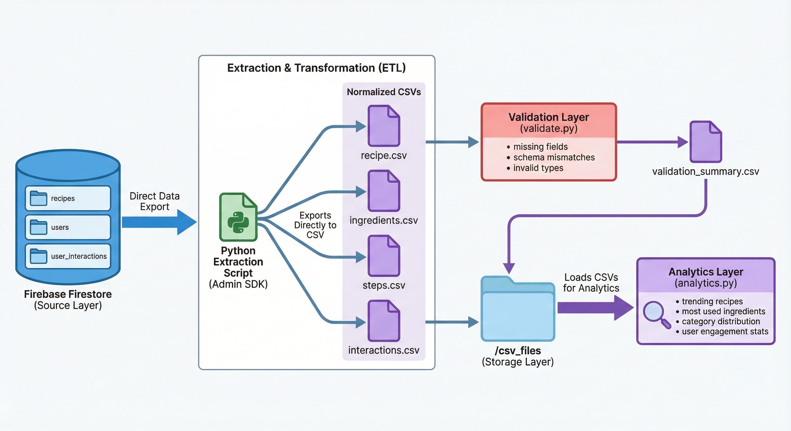

## 🔍 Extract
The pipeline pulls raw data from your Firestore collections such as:

`recipes`<br>
`ingredients`<br>
`steps`<br>
`users`<br>
`user_interactions (views, likes, ratings, cook attempts)`

## Extraction Highlights
- Uses Firebase Admin SDK via a service account key
- Reads nested subcollections and embedded arrays
- Loads JSON files exported from Firestore (Flex/REST/CLI export)

## 🔄 Transform
During transformation, the raw Firestore data is cleaned and reshaped into relational format.

## ✔ Normalization Steps
- Flatten nested JSON objects
- Convert arrays into separate tables
- Parse timestamps into ISO-8601 format
- Fix schema inconsistencies across documents

- Add generated fields (e.g., interaction IDs, recipe_uid)

## ✔ Generated Output Tables
- File	Description
- recipe.csv	Contains main recipe metadata
- ingredients.csv	Ingredient list linked via recipeId
- steps.csv	Step-by-step cooking instructions
- interactions.csv	Views, likes, cook attempts, ratings
- users.csv	User profile data
  
## 📥 Load
After transformation:
- All CSVs are stored inside:
```
/csv_files/.csv/
```
Each table is normalized and ready for:
- SQL import (PostgreSQL / MySQL)
- Power BI / Tableau dashboards
- Machine-learning models


---
## 📁 Project Structure
```
csv_files/
├── ingredients.csv
├── interactions.csv
├── recipe.csv
├── steps.csv
└── validation_summary.csv

images/
├── 1.png ... 10.png
├── model1.png

src/
├── analytics.py
├── etl_export_to_csv.py
├── seed.py
├── validate.py
└── requirements.txt
```

---
# 🚀 Running the Recipe Analytics Data Pipeline

Follow these steps to set up and run the **Firebase-based Recipe Analytics project** locally.

---

### 1️⃣ Prerequisites

Make sure you have the following installed:

- **Python 3.10+**
Check with:  
```
python --version
```
---
### 2️⃣ Install Dependencies

Install all required Python libraries:

```bash
pip install -r requirements.txt
```
---
### 3️⃣ Activate Virtual Environment 
```
python -m venv venv
venv\Scripts\activate        # Windows
source venv/bin/activate     # macOS/Linux
```
---

### 4️⃣ Firebase Console set-up
Open the Firebase console in your browser:

👉 https://console.firebase.google.com/

<details>
<summary> Creating a new project steps </summary>

### 1. Create a New Project

- Click “Add project” or “Create a project”
- Enter your Project Name
- Click Continue
---
### 2. Disable / Enable Google Analytics (Optional)

- You can disable, or
- Enable Google Analytics (optional)
 Click Continue.
---
### 3️. Firebase Will Create Your Project

Wait a few seconds until you see: 

✅ "Your new project is ready"  

Click Continue to go to your new Firebase dashboard.

---
### 4️⃣ Add Firestore Database

- From left sidebar → Click Build → Firestore Database
- Click Create database
- Select Start in production mode (recommended)
- Choose your Firestore region
- Click Enable
- Firestore is now ready to use.

</details>

---
### 5️⃣ Create a Service Account (Required for Python Scripts)

- Go to <br>
- Project Settings → Service Accounts <br> 
- Click “Generate new private key”  <br>
- A JSON file will download.

👉 Rename it to:
```
serviceaccount.json
```
👉 Place it in your project folder (e.g., src/service_account.json).

---
### 6️⃣ Install Firebase Admin SDK (Python)

In your virtual environment:
```
pip install firebase-admin
```
---
### 7️⃣ Configure Firebase

Place your Firebase service account JSON in the project folder.
Update your Main script (seed.py):
```
from firebase_admin import credentials, initialize_app

cred = credentials.Certificate("serviceaccount.json")
initialize_app(cred)

```
### 8️⃣ Run Main File
Run the `seed.py` to upload the collections and documents to firestore.<br> 
In firebase the stracture should be like this<br> 
The data model includes **recipes**, **users**, and **user_interactions** collections.  

<details>
<summary>Click to expand: Schema Overview</summary>

### 🥘 Recipes

| Field        | Type       | Description | Example |
|-------------|-----------|-------------|---------|
| `id`        | string     | Unique recipe ID | `"r1"` |
| `name`      | string     | Recipe name | `"Paneer Tikka Masala"` |
| `category`  | string     | Cuisine/category | `"Indian"` |
| `difficulty`| string     | Difficulty (`Easy`, `Medium`, `Hard`) | `"Medium"` |
| `cook_time` | integer    | Cooking time in minutes | `45` |
| `ingredients` | array    | List of ingredients | `[{"name": "Paneer", "qty": 200, "unit": "grams"}, ...]` |
| `steps`     | array      | Step-by-step instructions | `["Marinate paneer", "Fry cubes", ...]` |
| `createdAt` | timestamp  | Recipe creation datetime | `"2025-11-20T12:42:34+05:30"` |

### 👤 Users

| Field      | Type   | Description | Example |
|-----------|--------|-------------|---------|
| `userId`  | string | Unique user ID | `"u2"` |
| `name`    | string | User name | `"Ayuresh"` |
| `email`   | string | Optional email | `"ayuresh@example.com"` |

### 📊 User Interactions

Tracks **views, likes, cook attempts, and ratings**.

| Field             | Type      | Description | Example |
|------------------|-----------|-------------|---------|
| `userId`          | string    | User reference | `"u2"` |
| `recipeId`        | string    | Recipe reference | `"r16"` |
| `number_of_views` | integer   | Total views | `12` |
| `number_of_likes` | integer   | Total likes | `4` |
| `cook_attempts`   | integer   | Number of cook attempts | `5` |
| `avg_rating`      | float     | Average rating (1–5) | `3.8` |
| `timestamp`       | timestamp | Interaction datetime | `"2025-11-20T12:42:48+05:30"` |

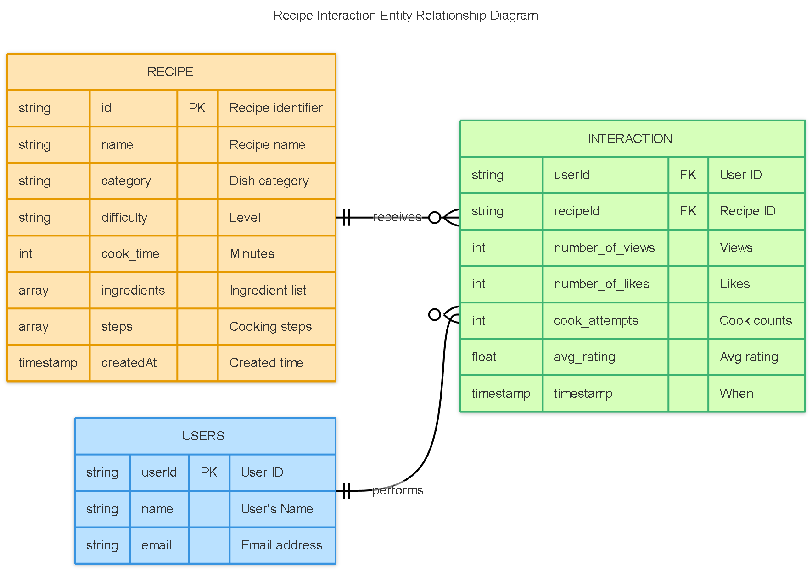


## Firebase Source Data Setup 🔹

- **Collections**: `recipes`, `users`, `interactions`  
- **Primary dataset**: Candidate’s own recipe  
- **Synthetic data**: 15–20 recipes, 10–20 users, sample interactions  
- **Firestore hierarchy example**:
```
recipes                               // Collection
 └── {recipeId}                       // Document
       ├── id
       ├── name
       ├── category
       ├── difficulty
       ├── cook_time
       ├── ingredients     
       ├── steps           
       └── createdAt

users                                // Collection
 └── {userId}                        // Document
       ├── userId
       ├── name
       └── email

user_interactions                    // Collection
 └── {interactionId}                 // Document
       ├── userId
       ├── recipeId
       ├── number_of_views
       ├── number_of_likes
       ├── cook_attempts
       ├── avg_rating
       └── timestamp
```

</details>

---
### 9️⃣ Run the ETL Pipeline

Extract data from Firebase and generate normalized CSV files:
```
python etl_export_to_csv.py
```
Output files:
| File | Description |
|------|-------------|
| `recipe.csv` | Contains the main recipe dataset |
| `ingredients.csv` | Lists ingredients for each recipe |
| `steps.csv` | Step-by-step cooking instructions |
| `interactions.csv` | Tracks user interactions (views, likes, cook attempts) |

---
### 🔟 Run Data Validation
Check data quality and generate a validation report:
```
python validate.py
```
Output file:
`validation_summary.csv`
| Collection        | Valid | Invalid |
|------------------|-------|---------|
| recipes          | 20    | 0       |
| ingredients      | 137   | 0       |
| steps            | 129   | 0       |
| user_interactions| 30    | 0       |


---
### Run Analytics

Generate insights and optional charts:
```
python analytics.py
```
Dynamic insights with visual separation and icons for clarity.
Outputs:
Console printout of analytics
folder image/imgs...
<details>
<summary>Click to expand: Insights </summary>

### 1 Most Common Ingredients 🥬
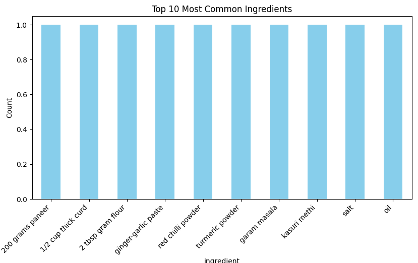

| Ingredient             | Count |
|------------------------|-------|
| 200 grams paneer       | 1     |
| 1/2 cup thick curd     | 1     |
| 2 tbsp gram flour      | 1     |
| ginger-garlic paste    | 1     |
| red chilli powder      | 1     |
| turmeric powder        | 1     |
| garam masala           | 1     |
| kasuri methi           | 1     |
| salt                   | 1     |
| oil                    | 1     |

---

### 2 Average Preparation Time ⏱️
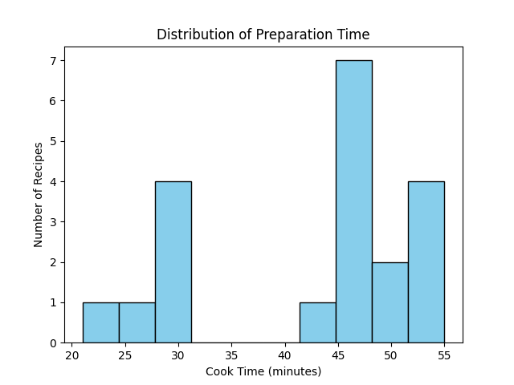  
**42.45 minutes**

---

### 3 Difficulty Distribution 🎚️
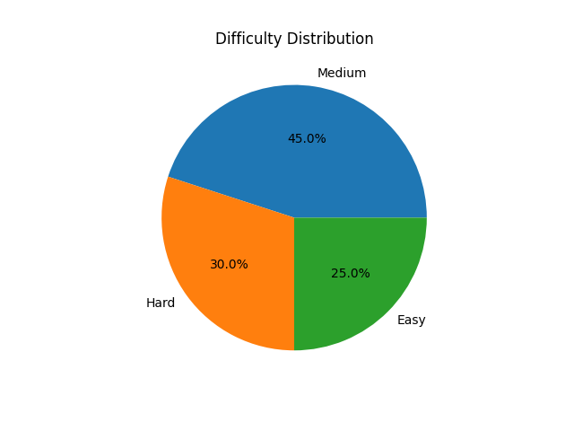

| Difficulty | Count |
|------------|-------|
| Medium     | 9     |
| Hard       | 6     |
| Easy       | 5     |

---

### 4 Most Frequently Viewed Recipes 👀
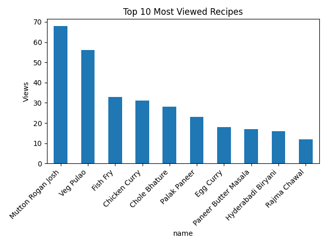

| Recipe Name             | Views |
|-------------------------|-------|
| Mutton Rogan Josh       | 68    |
| Veg Pulao               | 56    |
| Fish Fry                | 33    |
| Chicken Curry           | 31    |
| Chole Bhature           | 28    |
| Palak Paneer            | 23    |
| Egg Curry               | 18    |
| Paneer Butter Masala    | 17    |
| Hyderabadi Biryani      | 16    |
| Rajma Chawal            | 12    |

---

### 5 Recipes with Highest Average Likes ❤️
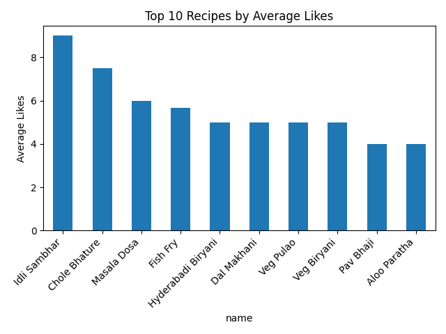

| Recipe Name             | Avg Likes |
|-------------------------|-----------|
| Idli Sambhar            | 9.0       |
| Chole Bhature           | 7.5       |
| Masala Dosa             | 6.0       |
| Fish Fry                | 5.67      |
| Hyderabadi Biryani      | 5.0       |
| Dal Makhani             | 5.0       |
| Veg Pulao               | 5.0       |
| Veg Biryani             | 5.0       |
| Pav Bhaji               | 4.0       |
| Aloo Paratha            | 4.0       |

---

### 6 Recipes with Highest Cook Attempts 👩‍🍳
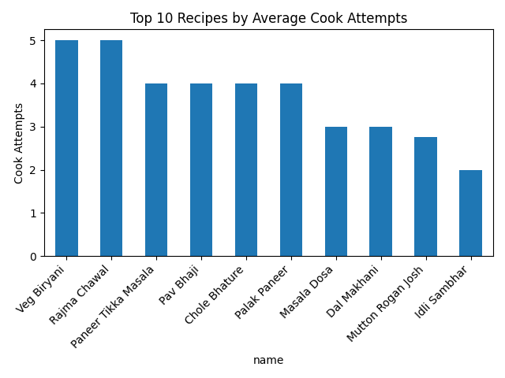

| Recipe Name             | Cook Attempts |
|-------------------------|---------------|
| Veg Biryani             | 5.0           |
| Rajma Chawal            | 5.0           |
| Paneer Tikka Masala     | 4.0           |
| Pav Bhaji               | 4.0           |
| Chole Bhature           | 4.0           |
| Palak Paneer            | 4.0           |
| Masala Dosa             | 3.0           |
| Dal Makhani             | 3.0           |
| Mutton Rogan Josh       | 2.75          |
| Idli Sambhar            | 2.0           |

---

### 7 Correlation between Prep Time & Likes 📈
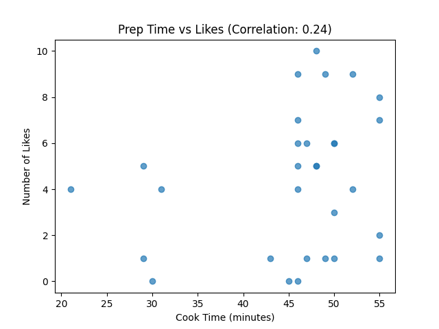  
**0.242** → small positive correlation

---

### 8 Top Rated Recipes ⭐
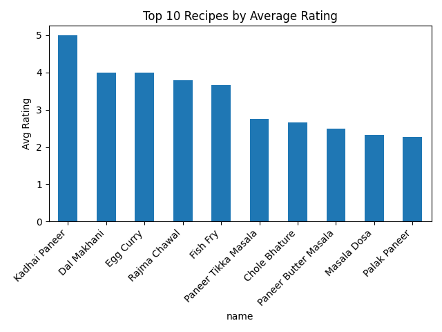

| Recipe Name             | Avg Rating |
|-------------------------|------------|
| Kadhai Paneer           | 5.0        |
| Dal Makhani             | 4.0        |
| Egg Curry               | 4.0        |
| Rajma Chawal            | 3.8        |
| Fish Fry                | 3.67       |
| Paneer Tikka Masala     | 2.75       |
| Chole Bhature           | 2.665      |
| Paneer Butter Masala    | 2.5        |
| Masala Dosa             | 2.33       |
| Palak Paneer            | 2.265      |

---

### 9 Ingredients with Highest Engagement 💬
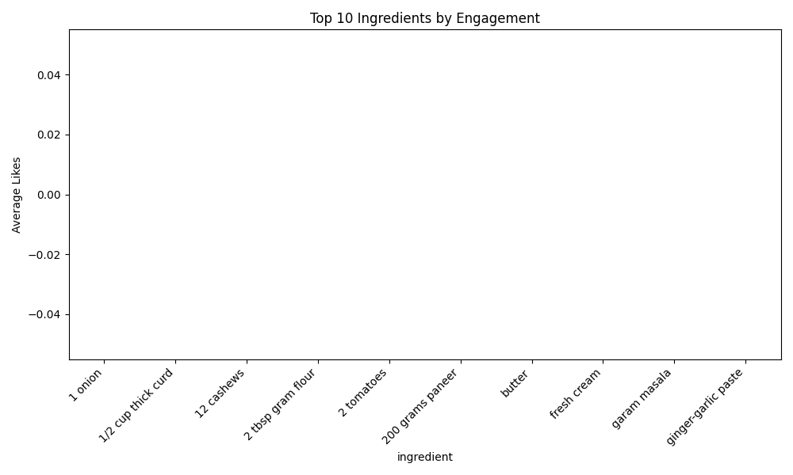

| Ingredient             | Avg Likes |
|------------------------|-----------|
| 1 onion                | 0.0       |
| 1/2 cup thick curd     | 0.0       |
| 12 cashews             | 0.0       |
| 2 tbsp gram flour      | 0.0       |
| 2 tomatoes             | 0.0       |
| 200 grams paneer       | 0.0       |
| butter                 | 0.0       |
| fresh cream            | 0.0       |
| garam masala           | 0.0       |
| ginger-garlic paste    | 0.0       |

---

### 10 Average Likes by Difficulty 🎚️
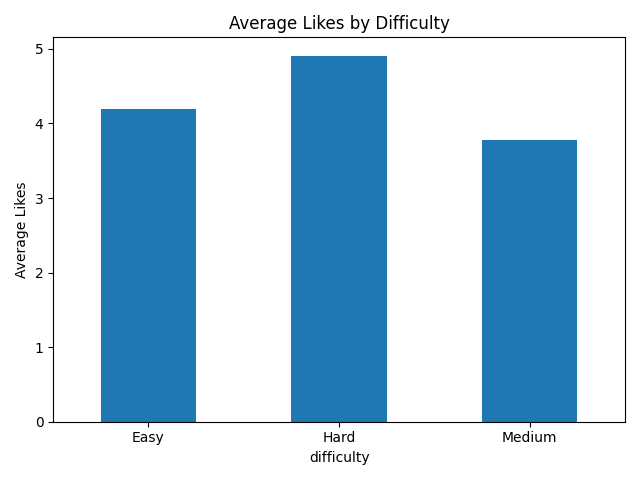

| Difficulty | Avg Likes |
|------------|-----------|
| Easy       | 4.2       |
| Hard       | 4.91      |
| Medium     | 3.78      |

</details>

---
### View Results

- Open CSV files in Excel or any editor
- Open images in the output/ folder
- Check README.md to confirm images display correctly

---
### ✅ Tips

- Use relative paths for images in README.md:
```

```

- Always activate your virtual environment before running scripts
- Keep images organized in images/ or charts in output/ folders
- Ensure Firebase service account has proper read access
---

### ⚠️ Known Constraints & Limitations

- Despite normalization, the dataset and Firestore structure may include some natural constraints:

- Firestore export format is not perfectly standardized
  Some nested fields or arrays may need manual cleaning.

- User interactions may be incomplete
  Not all users generate all types of interactions (views/likes/rating).

- Timestamps may differ in format
  Firestore timestamps → Python datetime → CSV (ISO format).

- Images are not downloaded
  Only URLs are stored, not the actual image files.

- Analytics accuracy depends on data completeness
  Sparse datasets may produce biased insights.

- Complex structures (subcollections) require extra handling
  E.g., if recipes contain subcollections like reviews/, they need separate extraction logic.
  
---
 ## 📚 References

### 🔥 Firebase & Firestore
- Firebase Firestore Docs — https://firebase.google.com/docs/firestore    

### 🐍 Python & Libraries
- Python Official Docs — https://docs.python.org/3/  
- Pandas Documentation — https://pandas.pydata.org/docs/  
- NumPy Documentation — https://numpy.org/doc/  
- CSV Module — https://docs.python.org/3/library/csv.html  

### 🧠 ETL Concepts 
- Normalization — https://www.geeksforgeeks.org/database-normalization/  

### 🖼️ Diagrams
- Mermaid.js — https://mermaid.js.org/   

